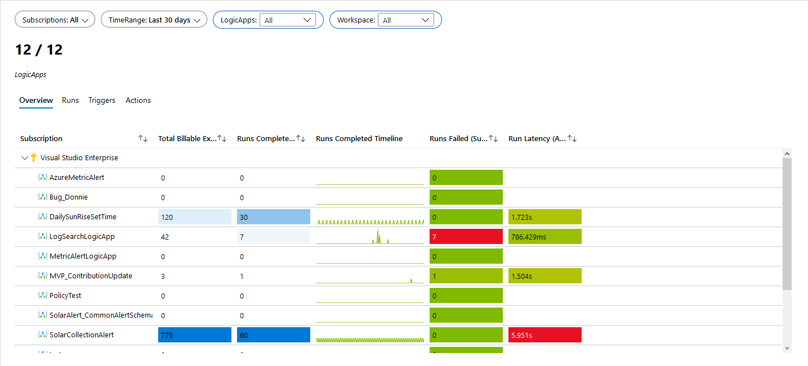
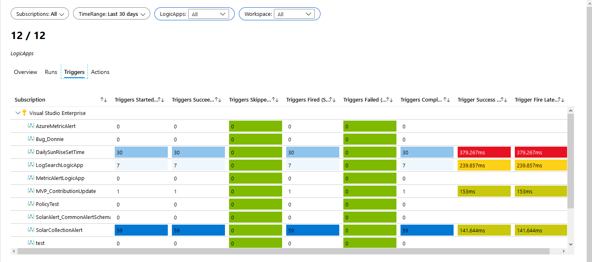
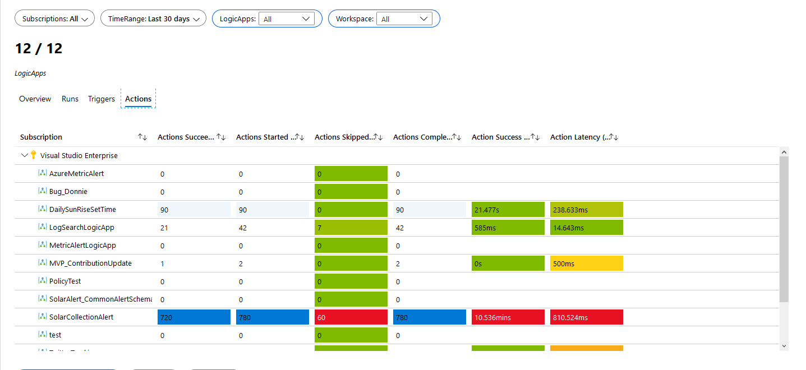
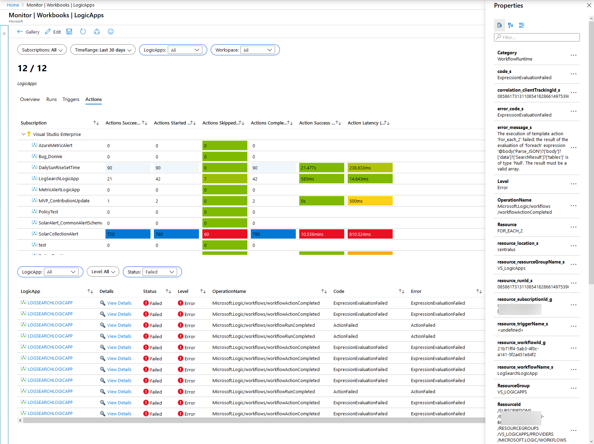
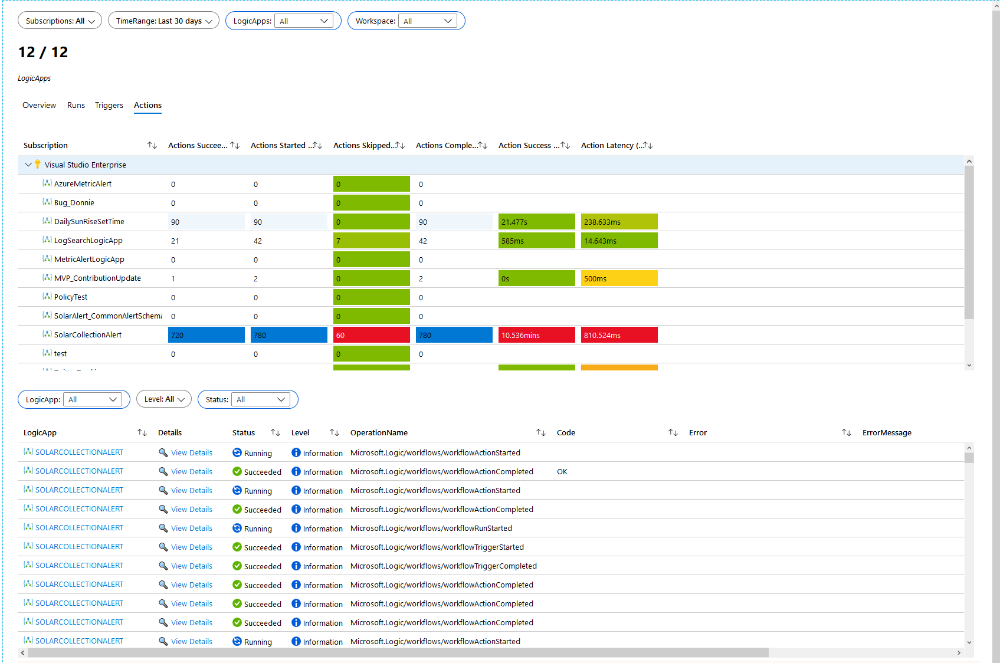

# Azure Monitor Workbook for LogicApps

## Purpose
Provides Azure Resource Metrics and Logs for LogicApps

## Other Info
to use the logs portion you will need to be collecting your diagnostic logs and sending them to a log analytics workspace

related blog post https://www.systemcenterautomation.com/2020/03/logicapps-azure-monitor-workbook/

## Workbook

## Notes
Please verify that the subscriptions parameter brings in all possible subscriptions. I have noticed importing these that it changes from All subscriptions to default subscriptions.